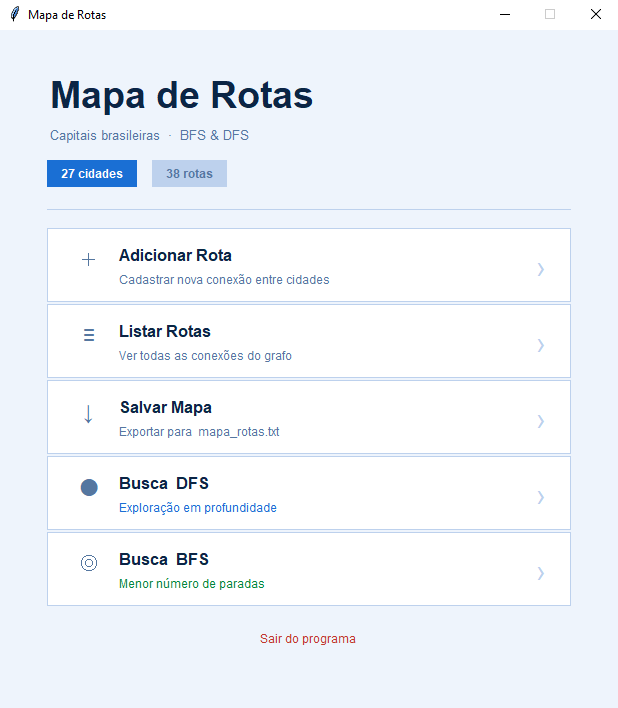
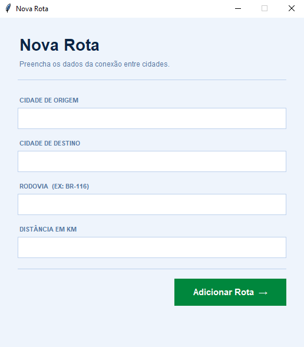
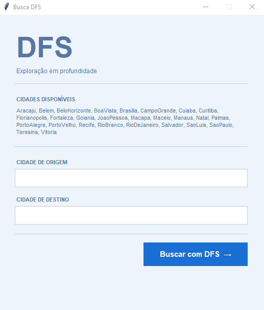
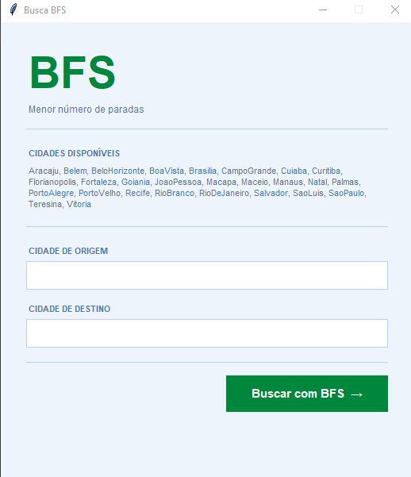

# G44_Grafos_PA-26.1

Conteúdo da Disciplina: Grafos<br>

## Alunos
|Matrícula | Aluno |
| -- | -- |
| 221007985  |  Diassis Bezerra Nascimento |
| 222024158  |  bruno Henryque Grangeiro Caetano |

# ConectaBR — Capitais Brasileiras

---

## Sobre

Este projeto implementa um **grafo de rotas rodoviárias entre capitais brasileiras** com interface gráfica em Python. O objetivo é demonstrar na prática os algoritmos de busca em grafos — **BFS (Busca em Largura)** e **DFS (Busca em Profundidade)** — aplicados a um problema real: encontrar caminhos entre cidades conectadas pelas principais rodovias federais do Brasil.

O programa já inicia com **27 cidades** e **39 rotas reais** pré-carregadas, baseadas em rodovias como BR-116, BR-364, BR-153, BR-101 e outras. O usuário pode adicionar novas rotas, salvar o mapa e buscar caminhos entre quaisquer duas cidades cadastradas.

**Como funciona:**

- As cidades são os **nós** do grafo
- As rodovias são as **arestas**, com peso de distância em km
- O grafo é **bidirecional**: se existe rota A → B, também existe B → A
- **BFS** encontra o caminho com o **menor número de paradas**
- **DFS** explora o grafo em **profundidade**, podendo encontrar caminhos alternativos

---

## Screenshots

### Tela 1


### Tela 2


### Tela 3


### Tela 4


---

## Instalação

**Linguagem:** Python 3.8+<br>
**Framework:** Tkinter (incluso na instalação padrão do Python)<br>
**Dependências externas:** nenhuma

### Pré-requisitos

Ter o Python 3 instalado. Para verificar:

```bash
python --version
```

O Tkinter já vem incluso no Python padrão. Caso esteja no Linux e não tiver:

```bash
sudo apt install python3-tk
```

### Como rodar

1. Clone ou baixe os arquivos do projeto
2. Coloque todos os arquivos na mesma pasta:

```
mapa_rotas/
├── main.py
├── grafo.py
├── telas.py
└── dados.py
```

3. Execute o arquivo principal:

```bash
python main.py
```

---

## Uso

Ao abrir o programa, a janela principal exibe 6 opções:

**1. Adicionar Rota**
Insira o nome da cidade de origem, destino, a rodovia e a distância em km. As rotas são bidirecionais automaticamente.

**2. Mostrar Rotas Cadastradas**
Lista todas as conexões do grafo com rodovia e distância.

**3. Salvar Mapa**
Salva as rotas adicionadas pelo usuário em `mapa_rotas.txt`. As rotas pré-definidas em `dados.py` não precisam ser salvas — são sempre carregadas ao iniciar.

**4. Busca em Profundidade (DFS)**
Digite a cidade de origem e destino. O algoritmo explora o grafo indo o mais fundo possível antes de retroceder. Exibe o caminho encontrado com as rodovias e distância total estimada.

**5. Busca em Largura (BFS)**
Igual ao DFS, mas garante o caminho com o **menor número de paradas** entre origem e destino.

**6. Sair**
Encerra o programa.

> Os nomes das cidades devem ser digitados **sem espaços e sem acentos**, exatamente como listados na tela de busca. Exemplo: `SaoPaulo`, `BeloHorizonte`, `PortoAlegre`.

### Cidades disponíveis (pré-carregadas)

```
Aracaju · Belem · BeloHorizonte · BoaVista · Brasilia · Cuiaba
CampoGrande · Curitiba · Florianopolis · Fortaleza · Goiania
JoaoPessoa · Macapa · Maceio · Manaus · Natal · Palmas
PortoAlegre · PortoVelho · Recife · RioBranco · RioDeJaneiro
Salvador · SaoLuis · SaoPaulo · Teresina · Vitoria
```

---

## Outros

### Estrutura do projeto

| Arquivo | Responsabilidade |
|---|---|
| `main.py` | Ponto de entrada. Inicializa o mapa e abre a janela principal |
| `grafo.py` | Classe `MapaRotas` com os algoritmos BFS e DFS |
| `telas.py` | Todas as telas da interface gráfica (tkinter) |
| `dados.py` | Rotas reais pré-definidas entre capitais brasileiras |

### Fontes dos dados

As rotas e distâncias foram baseadas nas principais rodovias federais brasileiras:

- **BR-116** — Fortaleza (CE) a Jaguarão (RS), maior rodovia do Brasil
- **BR-101** — Litoral, Touros (RN) a Rio Grande (RS)
- **BR-153** — Transbrasiliana, Belém-Brasília
- **BR-364** — São Paulo (SP) a Mâncio Lima (AC)
- **BR-060 / BR-040** — Rodovias radiais de Brasília
- **BR-262** — Vitória (ES) a Corumbá (MS)

### Limitações conhecidas

- O grafo não considera peso nas arestas para o BFS (trata todas as arestas como custo 1). Para encontrar o caminho de **menor distância em km**, seria necessário usar o algoritmo de **Dijkstra**.
- Algumas capitais da região Norte (Macapá, Boa Vista) têm conectividade limitada por falta de rodovias pavimentadas — isso é reflexo da realidade.
